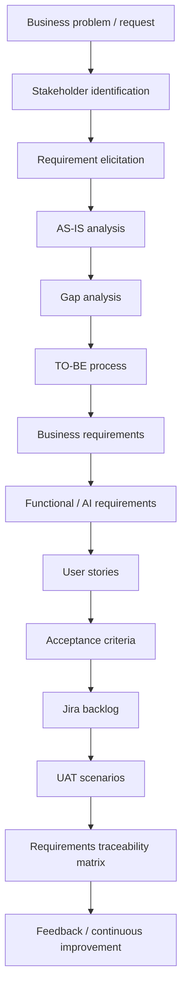

# How I Approach a Business Problem

This page shows the **Business Analysis lifecycle** I use across portfolio case studies. The goal is not to produce documents for their own sake—it is to move from an unclear business need to validated, deliverable requirements.

---

## Lifecycle in plain language

| Stage | What I do | Typical artifacts |
|-------|-----------|-------------------|
| **Business problem** | Clarify the ask, drivers, and success signals | Business request notes, problem statement |
| **Stakeholders** | Who cares, who decides, who uses the solution | Stakeholder register, RACI, power-interest |
| **Elicitation** | Workshops, interviews, document analysis | Notes, prioritized needs |
| **AS-IS** | How work happens today and where it hurts | Process models, pain points |
| **Gap analysis** | What must change to reach the target state | Gap table, priority |
| **TO-BE** | Future workflow with controls and handoffs | TO-BE process models |
| **Business requirements** | What the business needs (not how to build it) | BRD |
| **Functional / AI requirements** | System behavior; AI suggest vs human decide | FRD, AI rules, NFRs |
| **User stories & AC** | Delivery-ready slices of value | Stories, Given-When-Then AC |
| **Backlog** | Ordered work for Agile teams | Sample Jira backlog |
| **UAT** | How we prove it works for the business | UAT scenarios, sign-off model |
| **RTM & risks** | Coverage and residual risk | RTM, risk register |

---

## Principles I apply (especially in healthcare & AI)

1. **Human accountability** – AI may recommend; qualified people decide on clinical, safety, and regulatory-critical steps.  
2. **Traceability** – Requirements connect to process, stories, and tests.  
3. **Inspectability** – Audit trails and clear acceptance criteria support compliance conversations.  
4. **Outcomes over templates** – Every artifact answers a decision or reduces delivery risk.  
5. **Transparency** – Portfolio work is labeled as simulation so evaluators can judge method, not claim false client history.

---

## Where to see this in the portfolio

| Project | Emphasizes |
|---------|------------|
| [AI Healthcare RCM](rcm/index.md) | AI opportunity → rules → FRD → backlog |
| [Hospital Management System](hms/index.md) | Full classic BA chain |
| [Clinical Trial Management](ctms/index.md) | Domain + NFR + validation |
| [Analytics Dashboard](analytics/index.md) | KPIs → dashboard requirements → validation |
| [VigilAI Pharmacovigilance](pv/index.md) | Day-0 request → AI-augmented PV processes |

Return to [Home](index.md) or [About](about.md).
