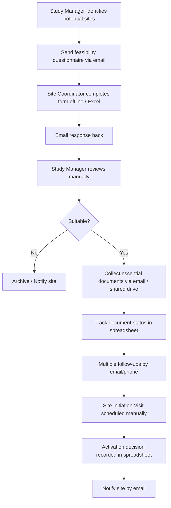
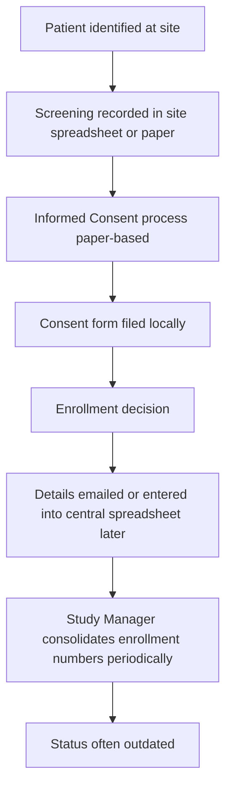
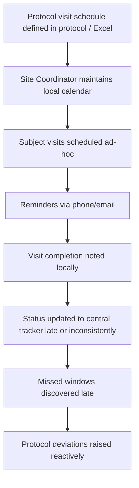

# AS-IS Process Models  
## TrialFlow CTMS – Current State

**Version**: 1.0  
*(Modeled in Mermaid – BPMN-inspired flow style)*

---

### 1. Site Feasibility & Activation – AS-IS

**Pain Points**: Version control issues, delayed responses, no single status view, high email volume, difficult audit trail.

---

### 2. Subject Screening & Enrollment – AS-IS

**Pain Points**: Delayed central visibility, risk of incomplete consent documentation tracking, enrollment forecasts unreliable.

---

### 3. Visit Scheduling & Tracking – AS-IS

**Pain Points**: Window compliance hard to monitor in real time, high risk of missed visits, limited proactive alerts.

---

### Summary of AS-IS Issues

| Process | Major Issues | Business Impact |
|---------|--------------|-----------------|
| Site Activation | Manual, email-driven, poor tracking | Delayed study startup |
| Enrollment | Fragmented data entry | Inaccurate metrics & forecasts |
| Visit Tracking | Local calendars, delayed updates | Protocol deviations, data gaps |
| Overall | Weak audit trail, dual data entry | Compliance risk, inefficiency |
