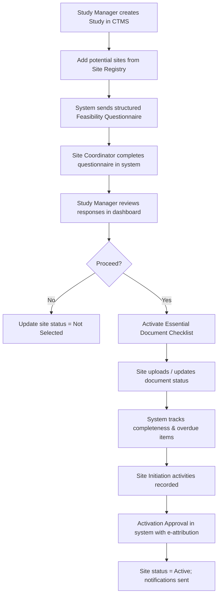
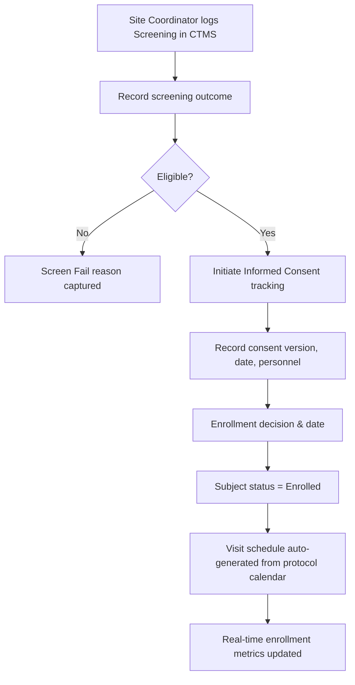
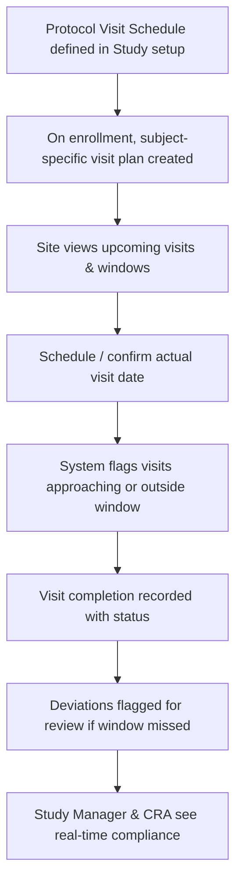

# TO-BE Process Models  
## TrialFlow CTMS – Future State

**Version**: 1.0

---

### 1. Site Feasibility & Activation – TO-BE

**Improvements**: Single source of truth, automated tracking, clear status, audit trail of decisions.

---

### 2. Subject Screening, Consent & Enrollment – TO-BE

**Improvements**: Immediate central visibility, structured consent tracking, automatic visit plan generation.

---

### 3. Visit Scheduling & Tracking – TO-BE

**Improvements**: Proactive window monitoring, reduced missed visits, consistent tracking across sites.

---

### Cross-Cutting TO-BE Benefits

- Role-based views (Study Manager vs Site Coordinator vs CRA)
- Complete electronic audit trail of key actions
- Standardized terminology and status values
- Dashboards for enrollment, site activation, and visit compliance
- Foundation for future EDC and eTMF integration
