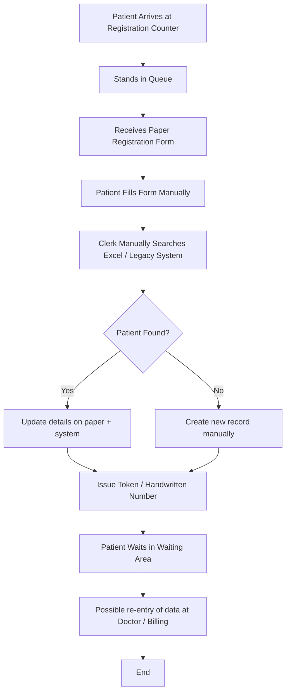
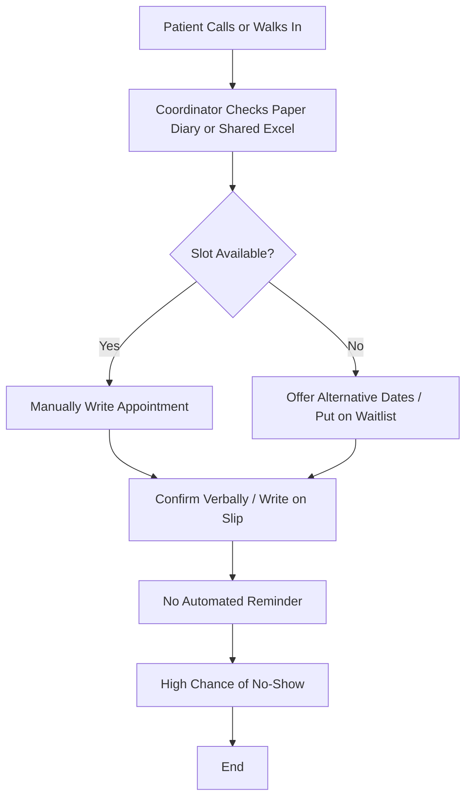
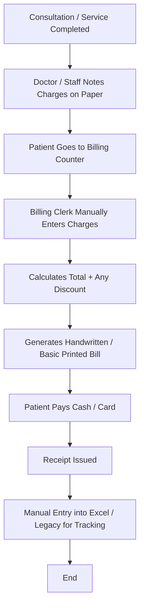

# AS-IS Process Models  
## CityCare General Hospital – Current State

**Version**: 1.0  
**Date**: August 2025

---

### 1. Patient Registration – AS-IS

**Trigger**: Patient arrives at hospital (walk-in or with prior appointment)

**Key Pain Points**:
- Average time: 12–18 minutes
- High rate of incomplete forms
- Duplicate records common (name variations, phone changes)
- No real-time status visibility
- Paper forms create storage and retrieval issues

---

### 2. Appointment Scheduling – AS-IS

**Trigger**: Patient or relative calls / walks in to book appointment

**Key Pain Points**:
- No real-time multi-user visibility
- Frequent double-booking or missed slots
- No automated reminders → high no-show rate (22–25%)
- Difficult to reschedule efficiently
- Poor utilization reporting

---

### 3. Billing Process – AS-IS

**Trigger**: Consultation or service completed

**Key Pain Points**:
- Charge capture delays and omissions
- Calculation errors
- Delayed invoicing
- Poor linkage between service and payment
- Difficult reconciliation and aging analysis

---

### Summary of AS-IS Issues

| Process | Major Issues | Impact |
|---------|--------------|--------|
| Registration | Manual search, paper forms, duplicates | Long queues, data quality problems |
| Appointments | Spreadsheet/paper based, no reminders | High no-shows, lost revenue |
| Billing | Manual charge entry, delayed | Revenue leakage, patient dissatisfaction |
