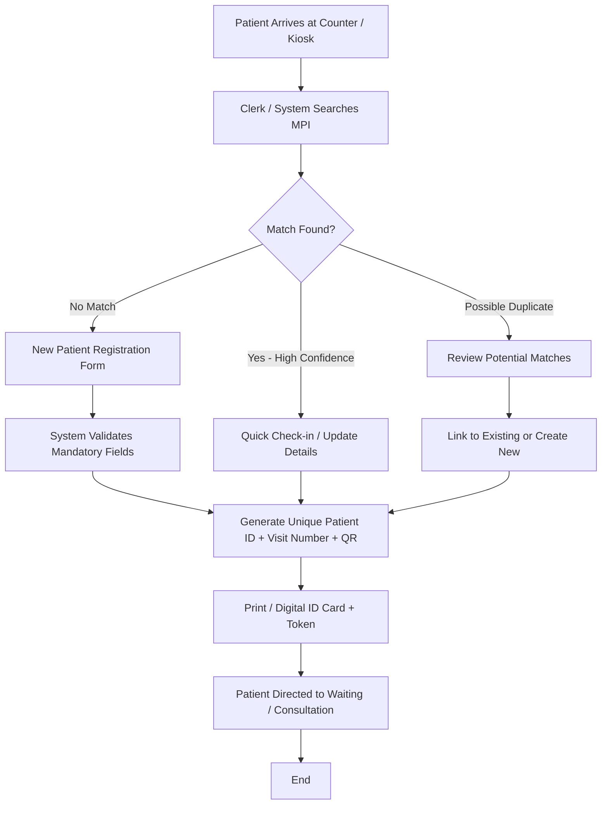
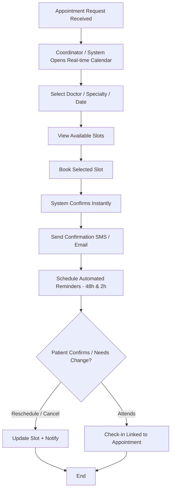
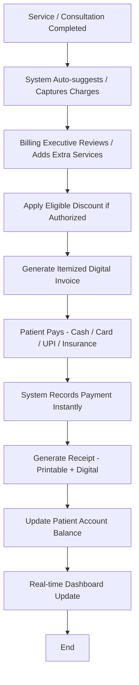

# TO-BE Process Models  
## CityCare General Hospital – Future State

**Version**: 1.0  
**Date**: August 2025

---

### 1. Patient Registration – TO-BE

**Trigger**: Patient arrives (or pre-registered online in future phase)

**Improvements**:
- Average registration time target: < 3 minutes
- Smart duplicate detection
- Mandatory field validation
- Instant unique ID generation
- Reduced paper dependency

---

### 2. Appointment Scheduling – TO-BE

**Trigger**: Patient request (phone, walk-in, or future self-service)

**Improvements**:
- Real-time multi-user calendar
- Automated reminders → expected significant drop in no-shows
- Easy rescheduling with audit trail
- Better slot utilization visibility

---

### 3. Billing Process – TO-BE

**Trigger**: Service / Consultation marked complete

**Improvements**:
- Automated charge capture reduces omissions
- Instant payment recording
- Clear itemized invoices improve transparency
- Real-time financial visibility

---

### Cross-Process Benefits in TO-BE

- Single source of truth for patient identity
- Seamless flow from Registration → Appointment → Billing
- Full audit trail for compliance
- Real-time operational and financial dashboards
- Foundation for future patient portal and advanced analytics
