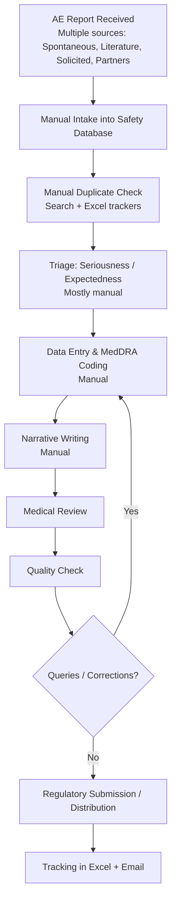
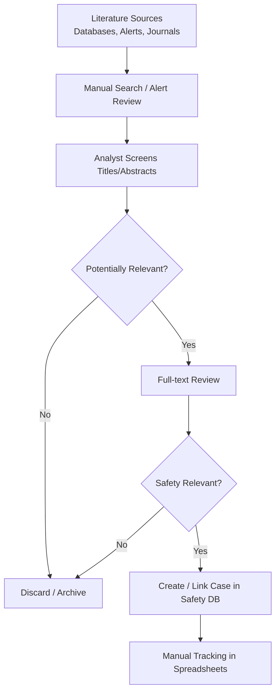
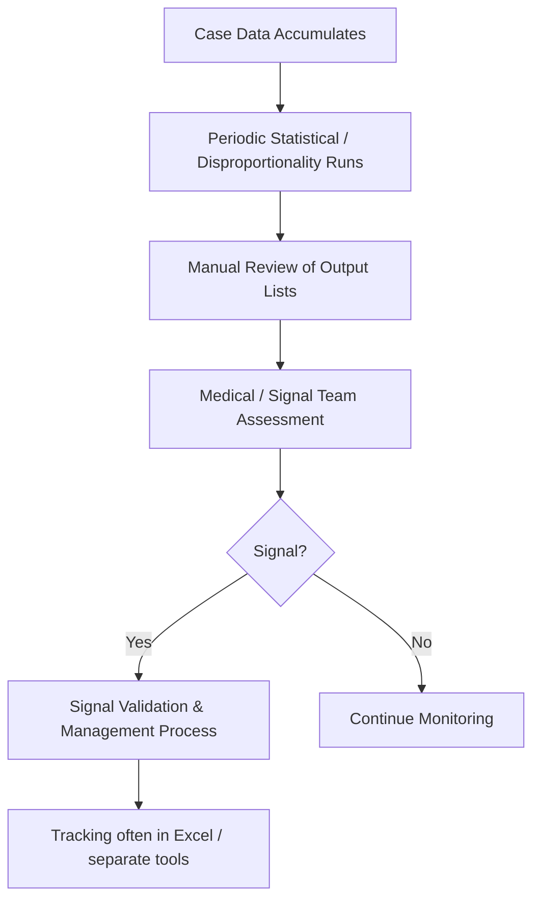

# AS-IS Process Models  
## VigilAI – Current Pharmacovigilance State

**Version**: 1.0

---

### 1. Safety Case Processing – AS-IS (High-Level)

**Pain Points**: High manual effort, variable quality, backlog risk, limited prioritization intelligence, weak real-time visibility.

---

### 2. Literature Monitoring – AS-IS

**Pain Points**: Labor-intensive, risk of missed articles, inconsistent screening criteria application, delayed case creation.

---

### 3. Signal Detection – AS-IS

**Pain Points**: Batch-oriented, slower insight, high manual filtering effort, limited integration with operational case workload.

---

### Summary of AS-IS Issues

| Area | Core Issues | Impact |
|------|-------------|--------|
| Case Processing | Manual intake, coding, narrative, QC | High cost, slow cycle time, variability |
| Literature | Manual screening | Resource drain, missed information risk |
| Signal Detection | Periodic + heavy manual review | Delayed detection, capacity constraints |
| Tracking & Visibility | Excel + email | Poor real-time oversight, audit difficulty |
