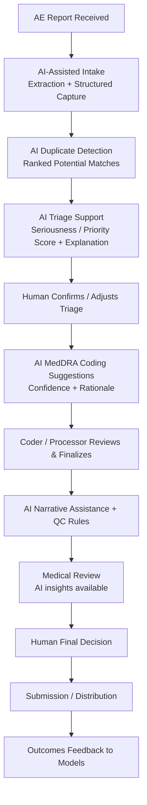
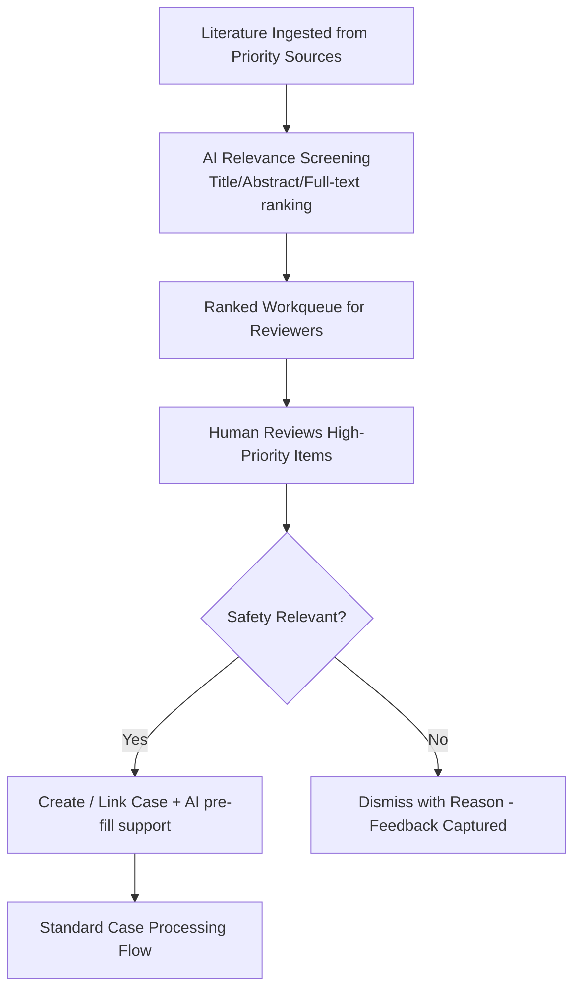
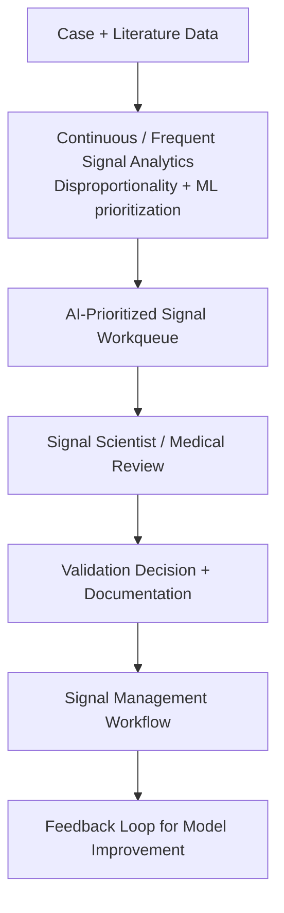

# TO-BE AI-Enabled Process Models  
## VigilAI – Future State

**Version**: 1.0

---

### 1. AI-Augmented Case Processing – TO-BE

**Key Design**: AI accelerates and standardizes; humans retain decision authority at critical points.

---

### 2. AI-Assisted Literature Monitoring – TO-BE

---

### 3. Enhanced Signal Detection – TO-BE

---

### Cross-Cutting TO-BE Capabilities
- Intelligent workqueues ranked by urgency, seriousness, and complexity
- Full audit trail of AI suggestions and human decisions
- Operational dashboards (volumes, cycle times, quality, signal pipeline)
- Explainability available at point of decision
