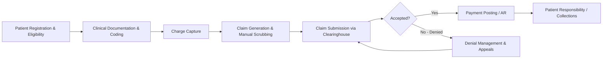
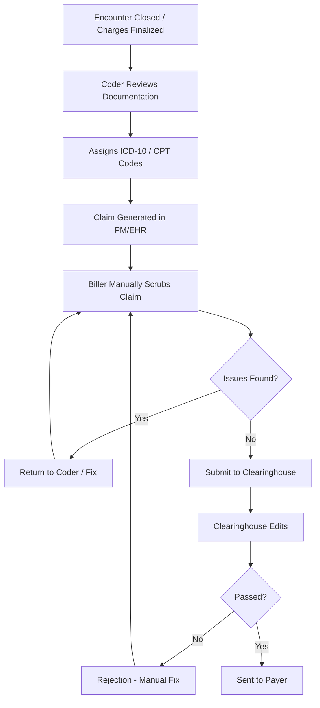
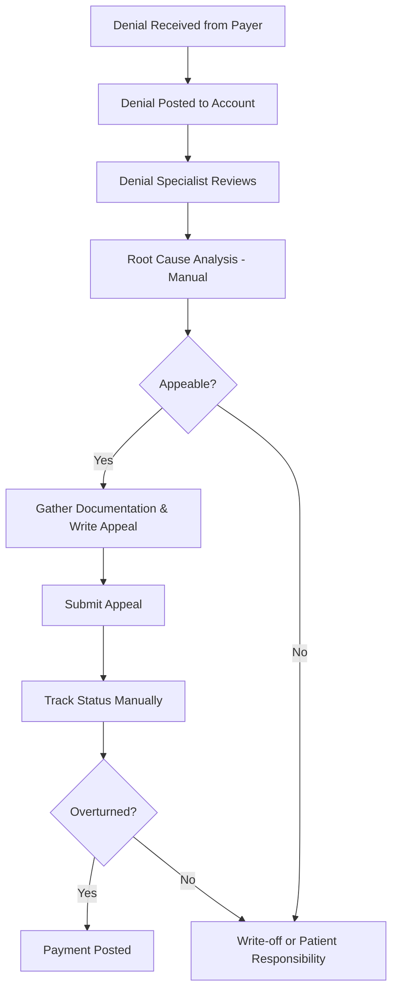

# AS-IS Revenue Cycle Workflows  
## MediClaim AI – Current State Analysis

**Version**: 1.0

---

### 1. High-Level RCM Value Chain (AS-IS)

---

### 2. Claims Preparation & Submission – AS-IS

**Pain Points**:
- Heavy manual scrubbing
- Inconsistent application of payer-specific rules
- Late discovery of issues (after submission)
- High volume of preventable rejections/denials

---

### 3. Denial Management – AS-IS

**Pain Points**:
- Reactive process
- High volume of low-value denials consuming specialist time
- Inconsistent root-cause capture
- Limited feedback loop into prevention

---

### 4. AR Follow-up – AS-IS

- Workqueues often sorted by aging or payer only
- Little prioritization by probability of payment or value
- High-touch, low-yield accounts worked equally with high-value ones
- Limited use of predictive signals

---

### Summary of AS-IS Issues

| Area | Key Issues | Business Impact |
|------|------------|-----------------|
| Claim Scrubbing | Manual, inconsistent, late | Low clean claim rate, high rework |
| Coding | Variability, under/over coding risk | Revenue leakage + compliance risk |
| Denials | Reactive, high volume | High cost-to-collect, delayed revenue |
| AR Management | Poor prioritization | Sub-optimal cash acceleration |
| Feedback Loop | Weak prevention | Same errors repeated |
