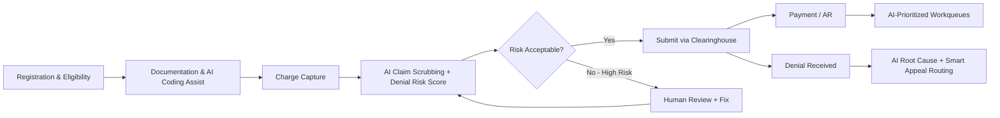
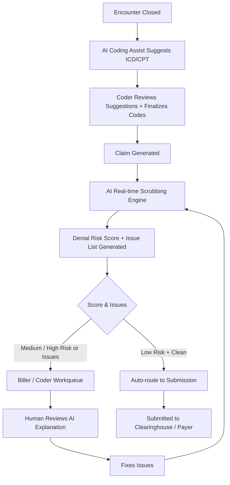
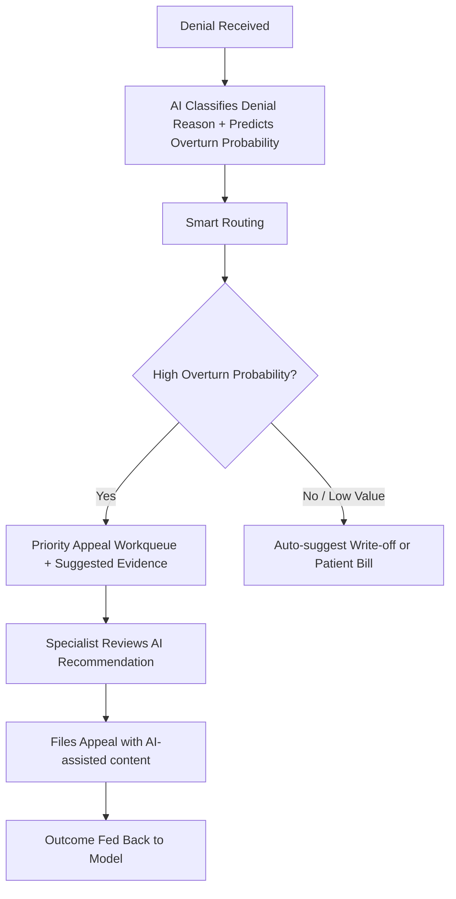

# TO-BE AI-Enabled RCM Workflows  
## MediClaim AI – Future State

**Version**: 1.0

---

### 1. High-Level TO-BE Value Chain

---

### 2. AI-Augmented Claim Preparation – TO-BE

**Key Improvements**:
- Issues caught before submission
- AI provides explainable reasons
- Human remains final decision maker
- Continuous learning from outcomes

---

### 3. Intelligent Denial Management – TO-BE

---

### 4. AI-Prioritized AR Workqueue – TO-BE

- Accounts ranked by composite score:  
  **Expected Value × Probability of Collection × Aging Factor × Strategic Priority**
- Specialists work highest-impact accounts first
- AI flags accounts needing clinical review vs pure administrative follow-up

---

### 5. Human-in-the-Loop Principles (Design Mandate)

1. AI **recommends**, humans **decide** on coding and high-risk claims  
2. Every AI score/recommendation must have an explanation  
3. Users can accept, modify, or reject AI suggestions (feedback captured)  
4. Override reasons are logged for model improvement and compliance  
5. Final coding responsibility remains with certified coder
