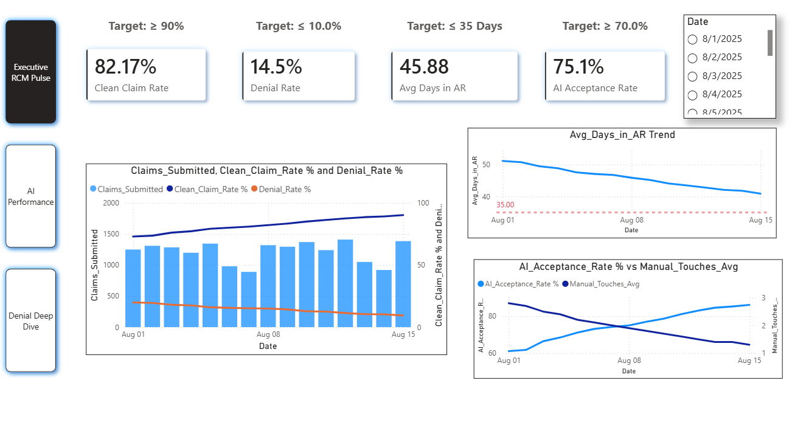
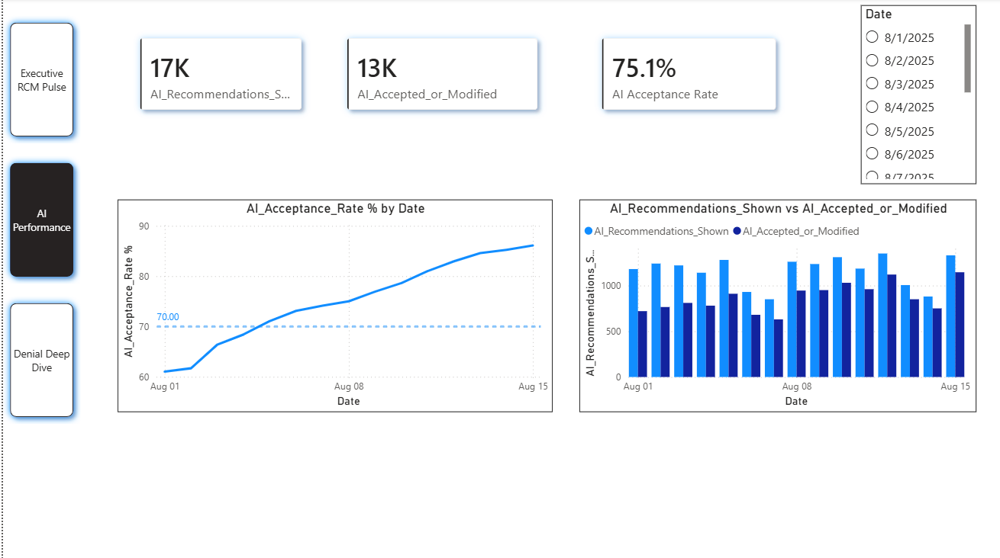
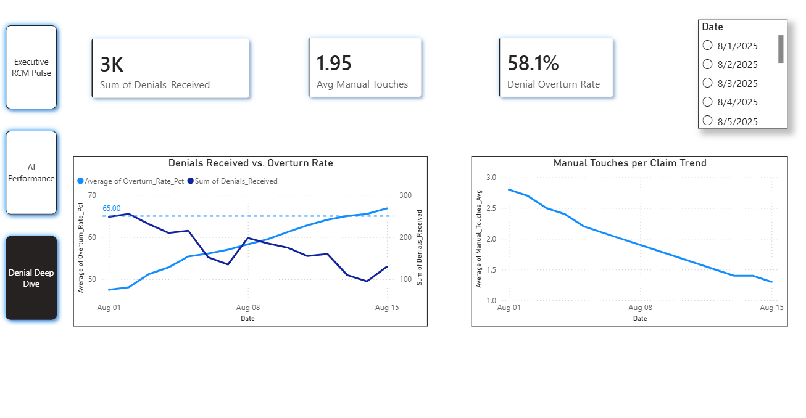

# KPI & Dashboard Definition  
## MediClaim AI

**Version**: 1.0

---

### Core RCM + AI KPIs

| KPI | Description | Target | Owner |
|-----|-------------|--------|-------|
| First-Pass Clean Claim Rate | % of claims accepted on first submission | ≥ 90% | RCM Director |
| Overall Denial Rate | % of claims denied | ≤ 10% | RCM Director |
| Average Days in AR | Average days from claim to payment | ≤ 35 | PFS Leader |
| AI Recommendation Acceptance Rate | % of AI suggestions accepted or lightly modified | ≥ 70% | AI + RCM |
| Manual Touch Rate | Average human interventions per claim | ↓ 40% | Ops |
| Denial Overturn Rate | % of appealed denials successfully overturned | ≥ 65% | Denial Lead |
| Model Precision (Denial Prediction) | At operating threshold | Agreed pilot target | Data Science |
| Model Recall (Denial Prediction) | At operating threshold | Agreed pilot target | Data Science |

---

### Recommended Dashboard Pages

#### 1. Executive RCM Pulse
Clean Claim Rate · Denial Rate · Days in AR · Collection Trends · AI Adoption

<figure markdown="span">
  { align=center }
  <figcaption>Executive RCM Pulse Dashboard</figcaption>
</figure>

---

#### 2. AI Performance
Acceptance Rate · Precision/Recall Trends · Override Reasons Distribution · Drift Alerts

<figure markdown="span">
  { align=center }
  <figcaption>AI Performance Dashboard</figcaption>
</figure>

---

#### 3. Denial Deep Dive
Denial Reasons · Overturn Rates by Category · AI vs. Manual Performance

<figure markdown="span">
  { align=center }
  <figcaption>Denial Deep Dive Dashboard</figcaption>
</figure>

---

### Sample Data

:material-file-delimited-outline: See [`Sample-Metrics-Data.csv`](Sample-Metrics-Data.csv) for illustrative daily metrics that can be used to build demo dashboards in Power BI or Tableau.
